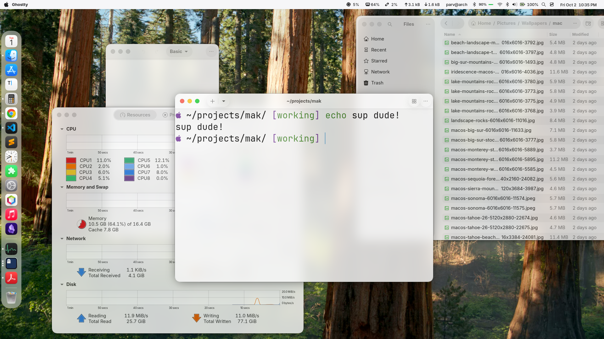
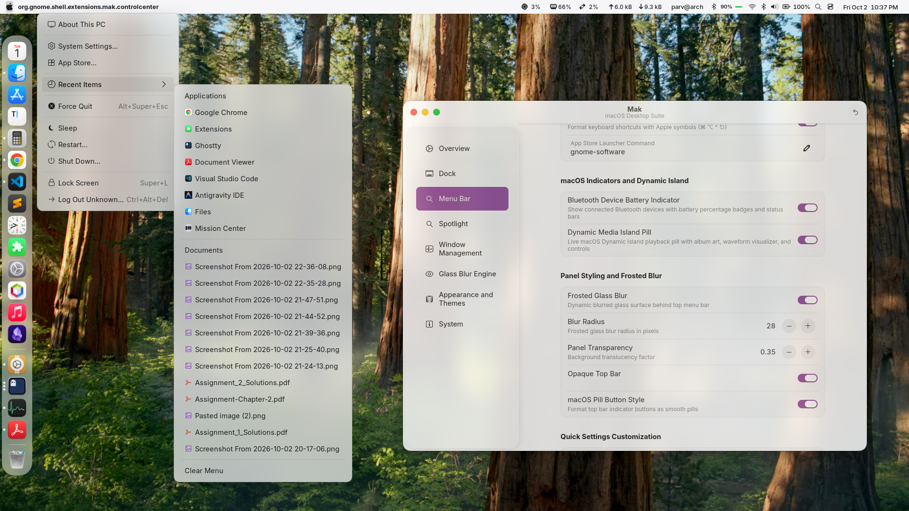
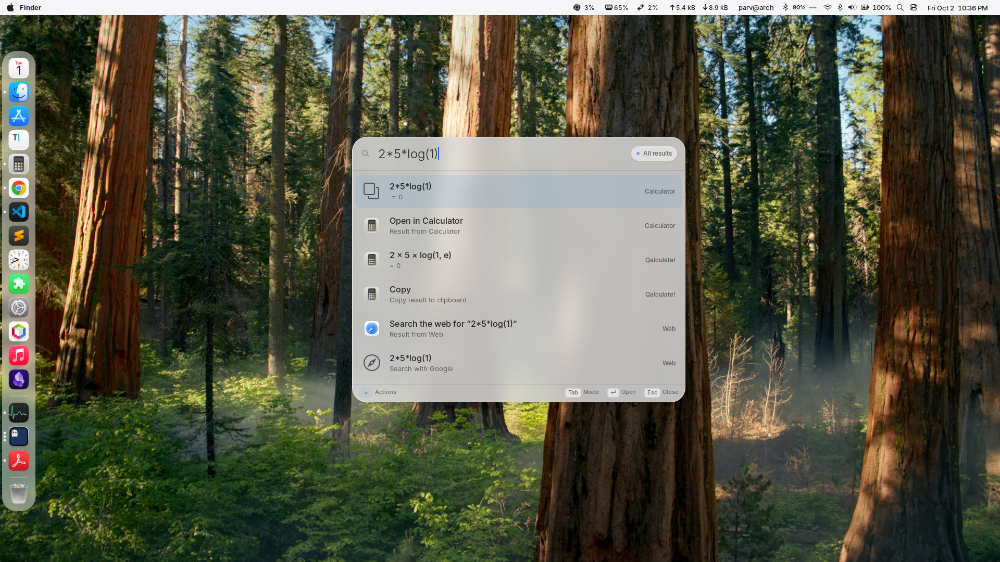

# 🍎 Mak: Unified macOS Desktop Suite for GNOME

[](https://www.gnome.org/)
[](https://gnome.pages.gitlab.gnome.org/libadwaita/)
[](https://wayland.freedesktop.org/)
[](LICENSE)

**Mak** delivers an authentic, uncompromising macOS desktop experience on GNOME. It integrates every essential macOS component — a floating glass dock with magnification physics, top menu bar with system Apple menu, fullscreen Spotlight search modal (`Super + Space`), anti-aliased squircle window shaders, outer window padding/gaps, realistic window drop shadows, and a hardware-accelerated glass blur engine — into a **single, standalone codebase**.

Zero external extension spaghetti. Everything is synchronized in real-time through the dedicated **Mak Control Center** (`mak-app`), built natively with GTK 4 and Libadwaita.

---

## 📸 Visual Showcase & Demos

### 🖥️ The Complete Desktop Experience
An authentic macOS aesthetic featuring the translucent top bar with system Apple menu, squircle window geometry with outer gaps, and the floating glass dock with magnification physics.



---

### 🎛️ Dedicated Mak Control Center (`mak-app`)
A unified GTK 4 + Libadwaita control panel exposing over 140 granular settings across 8 dedicated sections, syncing the master schema and active desktop components in real-time.



---

### 🔍 Spotlight Search Modal (`Super + Space`)
Instant, keyboard-first modal overlay providing integrated web searches, application launching, active window switching, inline mathematical evaluations, and live weather.



---

## 🌟 Why Mak? From Extension Spaghetti to Unified Harmony

Achieving an authentic macOS desktop previously required installing and juggling 7+ disparate extensions from different authors. This created layout conflicts, competing stylesheets, broken blur shaders, compositor crashes, and fragmented settings.

| Component | The Old Fragmented Way (Disparate Extensions) | The Mak Way (Unified Suite) |
|---|---|---|
| **Dock** | `aqua-dock-pro`, `dash-to-dock`, or `dash2dock-lite` | **Built-in macOS Floating Glass Dock** with spring magnification physics |
| **Top Menu Bar** | `bar-enhanced`, `superbar`, `kiwimenu`, `transparent-top-bar` | **Built-in macOS Top Bar & Apple Menu** with dynamic frosted glass |
| **Spotlight** | `search-light` | **Built-in Spotlight Search Modal** (`Super + Space`) |
| **Window Gaps** | `window-gap` or `gnome-maximized-window-gap` | **Built-in Struts-Injected Window Gaps** (retained when maximized) |
| **Window Squircles** | `rounded-window-corners` or `...-reborn` | **Built-in Cogl GLSL Squircle Shader** (with Chromium gutter mask fix) |
| **Glass Blur** | `blur-my-shell` | **Built-in Hardware-Accelerated Glass Blur Engine** |
| **Control Panel** | 7 different GNOME Extensions Prefs windows | **Single Native GTK 4 + Libadwaita Control Center** (`mak-app`) |
| **Themes & Styling** | Broken traffic light buttons & vertical repeat in Chrome | **Curated macOS Themes** with universal anti-repeat GTK 3/4 styling |

---

## ⚠️ Conflicting Extensions (Must Be Disabled)

Because **Mak integrates all of these modules natively**, running legacy third-party extensions alongside Mak causes compositor shader conflicts, broken window blur, double dock/panel overlaps, and duplicate window borders.

The automated installer (`./install.sh`) **automatically audits and disables** these for you, or you can disable them manually:

| Extension UUID | Legacy Extension Name | Why It Conflicts & What Replaces It |
|---|---|---|
| `blur-my-shell@aunetx` | **Blur My Shell** | Conflicts with Mak's built-in Cogl hardware blur pipeline |
| `aqua-dock-pro@shaque` | **Aqua Dock Pro** | Collides with Mak's native floating glass dock |
| `dash-to-dock@micxgx.gmail.com` | **Dash to Dock** | Causes duplicate docks and competing edge margins |
| `dash2dock-lite@icedman.github.com`| **Dash2Dock Lite** | Causes duplicate docks and competing edge margins |
| `rounded-window-corners@fxgn` | **Rounded Window Corners** | Causes duplicate corner shaders and broken borders |
| `rounded-window-corners-reborn@firox242` | **Rounded Window Corners Reborn** | Causes duplicate corner shaders and broken borders |
| `window-gap@amirhosseinkarimi.github.io` | **Window Gap** | Conflicts with Mak's maximized struts layout hook |
| `gnome-maximized-window-gap@local` | **Maximized Window Gap** | Redundant; built directly into Mak window management |
| `search-light@icedman.github.com` | **Search Light** | Collides with Mak's `Super + Space` Spotlight modal |
| `bar-enhanced@mrvanguardia` | **Bar Enhanced** | Collides with Mak's top bar layout and status pills |
| `superbar@Furkan-rgb.github.io` | **Superbar** | Collides with Mak's top bar layout and status pills |
| `kiwimenu@kemma` / `kiwi@kemma` | **Kiwi Menu** | Redundant; Mak features an integrated Apple Menu |
| `transparent-top-bar@ftpix.com` | **Transparent Top Bar** | Overrides Mak's dynamic panel frosted glass engine |
| `vibe-panel@pakovm` | **Vibe Panel** | Conflicts with Mak's panel CSS and blur hooks |
| `compiz-alike-magic-lamp-effect@hermes83.github.com` | **Magic Lamp Effect** | Redundant; Mak has built-in dock genie minimize physics |

> [!NOTE]
> The **User Themes** extension (`user-theme@gnome-shell-extensions.gcampax.github.com`) should **remain enabled** so GNOME Shell can apply Mak's curated macOS shell themes.

---

## 🚀 Key Feature Breakdown

### 1. ⛵ macOS Floating Glass Dock
- **Layout & Geometry**: Screen position (Bottom, Left, Right), alignment (Center, Start, End), resting icon size (24px–128px), icon spacing, floating edge margin, dock scale factor, auto-shrink, and multi-monitor isolation.
- **Magnification & Physics Engine**: Peak magnification factor (1.0x–3.5x), spread range, curve sharpness falloff, follow animation smoothness, spring tension, spring damping, hover icon lift, and launch bounce physics.
- **Glass Pill & Appearance**: Pill corner radius, background translucency opacity, background tint, border stroke width, border color, and automatic thickness scaling.
- **Autohide & Pressure Barrier**: Autohide behavior (Always Visible, Intellihide/Dodge, Always Hide), hide delay, edge reveal pressure barrier, autohide handle indicator, and pressure-sense dwell reveal.
- **Interactions & Clicks**: Click focused app to minimize, primary left-click action (smart, minimize, cycle, previews, nothing), middle-click action, scroll wheel action, and drag icon outside to launch.
- **Indicators & Badges**: Indicator styles (glow dots, glowing bar, single dot, multiple dots, solid line, pill), dot size, indicator color, multi-window count dots, and notification counter badges.
- **Stacks & Special Items**: Applications launcher grid button, trash can with full/empty states, Downloads folder stack (fan, grid, list view), and mounted drives.
- **Live Window Previews & Tooltips**: Live window thumbnail previews on hover with close buttons, app tooltips, and genuine genie (magic lamp) minimize animations.

### 2. 🍏 macOS Menu Bar & Apple Menu
- **System Branding & Logo**: Apple logo menu on panel left, custom logo icons (Apple, Arch Linux, Fedora, Debian, Ubuntu, Linux Tux), and active application name in bold beside the menu.
- **macOS Accelerators**: Standard macOS keyboard accelerator symbols (⌘ ⌥ ^ ⎋), custom App Store launcher command, and Force Quit keyboard shortcut.
- **Panel Styling & Frosted Glass**: Dynamic frosted glass blur effect, blur radius, panel transparency factor, and smooth macOS pill button styling for status indicators.
- **Quick Settings Customization**: Toggle individual quick settings actions (hide lock screen button, hide power/shutdown button, hide settings button).

### 3. 🔍 Spotlight Search Modal (`Super + Space`)
- **Modal Geometry & Layout**: Trigger shortcut, search modal bar width (400px–1200px), vertical placement (center, top, bottom), glass surface opacity, and adaptive ranking history for frequent applications.
- **Integrated Providers**: Web search (Google, DuckDuckGo, Bing, Brave, Ecosia, Kagi), installed applications, open windows across workspaces, local files and documents, clipboard history, inline mathematical calculator evaluation, live weather forecast, and dictionary word definitions.

### 4. 🪟 Window Management: Gaps, Squircles & Shadows
- **Outer Window Gaps**: Uniform mode, custom gap size (0px–200px), independent per-edge margins (top, bottom, left, right), and **gap retention for maximized windows**.
- **Rounded Corners & Borders**: Anti-aliased squircle window shader, corner radius, Apple super-ellipse curvature exponent ($n = 0.8$), window border stroke width, border color, and retain corners when maximized or fullscreen.
- **macOS Window Drop Shadows**: Drop shadows with realistic depth, retain shadows for maximized windows, focused window vertical offset, blur radius, and opacity.
- **Traffic Light Controls**: Custom button diameter (10px–22px) and inter-button spacing (0px–24px) with universal anti-repeat CSS rules for GTK 3, GTK 4, Chromium, and Electron.

### 5. 🔮 Hardware-Accelerated Glass Blur Engine
- **Gaussian Kernel Tuning**: Global blur master toggle, blur sigma radius (10–80), glass brightness luminance multiplier, and film grain / noise amount.
- **Target Surfaces**: Independent toggles for top menu bar, dock pill background, activities overview wallpaper, and application folder popups.

### 6. 🎨 Curated macOS Themes & Global Synchronization
- **6 Curated Themes** (installed in `~/.themes/`):
  - `>>>Mac-Dark-solid-purple`: macOS Sonoma graphite dark mode.
  - `>>>Mac-Light-solid-purple`: Crisp, luminous Apple light mode.
  - `>>>Mac-Dark-Amoled-purple`: Pure OLED pitch black (`#000000`) with Apple purple accents.
  - `>>>Mac-Dark-glassy-purple`: Frosted translucent graphite glass.
  - `>>>Mac-Light-glassy-purple`: Frosted translucent Apple glass.
  - `>>>Mac-Dark-Amoled-glassy-purple`: Frosted translucent OLED obsidian glass.
- **1-Click Global Sync**: Simultaneously configures GNOME Shell User Theme, GTK 4 / Libadwaita (`~/.config/gtk-4.0/`), GTK 3 (`~/.config/gtk-3.0/`), GTK 2 (`~/.gtkrc-2.0`), and Flatpak sandbox overrides (`flatpak override --user`).

---

## 📦 Installation Guide

### 1. Prerequisites & Dependencies

Mak requires **GNOME 45, 46, 47, or 48+**, Python 3, PyGObject, GTK 4, and Libadwaita.

Install the necessary dependencies for your distribution:

#### 🔵 Arch Linux / Manjaro
```bash
sudo pacman -S python-gobject gtk4 libadwaita glib2 gnome-shell-extensions
```

#### 🔵 Fedora / RHEL
```bash
sudo dnf install python3-gobject gtk4 libadwaita glib2 gnome-shell-extension-user-theme
```

#### 🔵 Ubuntu (24.04+) / Debian (13+)
```bash
sudo apt update
sudo apt install python3-gi gir1.2-gtk-4.0 gir1.2-adw-1 libglib2.0-bin gnome-shell-extension-manager
```

---

### 2. Automated Installation (Recommended)

Clone the repository and run the automated installer:

```bash
git clone -b working https://github.com/parv141206/mak.git
cd mak
chmod +x install.sh
./install.sh
```

#### Installer Command-Line Flags
The installer includes several flags for custom and non-interactive workflows:
```bash
# Non-interactive automated install (accepts prompts and disables conflicting extensions)
./install.sh -y

# Automatically audit and disable conflicting extensions
./install.sh --disable-conflicts

# Cleanly uninstall Mak (removes extension, launcher binary, and desktop entries)
./install.sh --uninstall

# View help and options
./install.sh --help
```

---

### 3. What the Installer Does Automatically
1. **Pre-flight Checks**: Verifies system utilities (`glib-compile-schemas`, `gsettings`, `gnome-extensions`) and PyGObject GTK 4 / Libadwaita bindings.
2. **Theme Deployment**: Copies all 6 curated macOS themes to `~/.themes/` and creates GTK 3 & GTK 4 asset symlinks.
3. **Extension Installation**: Compiles GSettings schemas, installs them into `~/.local/share/glib-2.0/schemas/`, and copies `mak-extension` to `~/.local/share/gnome-shell/extensions/mak@local`.
4. **Conflict Resolution**: Audits active extensions and disables legacy conflicting extensions (`blur-my-shell`, `aqua-dock-pro`, `dash-to-dock`, `rounded-window-corners`, `window-gap`, `search-light`, etc.).
5. **Control Center Setup**: Installs the `mak-app` launcher binary into `~/.local/bin/` and creates a FreeDesktop application entry in `~/.local/share/applications/`.
6. **Live Theme Initialization**: Injects initial anti-repeat CSS rules and window geometry into `~/.config/gtk-3.0/` and `~/.config/gtk-4.0/`.

---

## 🛠️ How to Use

### Launching the Control Center
Open Mak Control Center from your terminal:
```bash
mak-app
```
Or launch **Mak** directly from your desktop Application Menu / App Grid.

### Keyboard Shortcuts
| Shortcut | Action |
|---|---|
| `Super + Space` | Open **Spotlight Search** modal |
| `Super + Q` | Close active window |
| `⌘ / Super` | Open GNOME Overview |

---

## 🔬 Deep Dive: Engine Architecture & Technical Shenanigans

Achieving authentic macOS aesthetics on Wayland and GNOME Shell required solving deep compositor-level challenges involving Mutter actor hierarchies, Cogl GLSL shaders, and GTK 4/3 styling.

### 1. Chromium & Electron Shader Gutter Masking Fix (`window-corners/`)
- **The Problem**: On Wayland, Chromium-based browsers, Electron apps (VS Code, Discord, Spotify), and certain XWayland clients allocate an invisible transparent gutter around the window for client-side resize handles and drop-shadow buffers. Standard corner shaders drew the rounded border around the outer boundary of this transparent buffer, creating an unsightly "floating outer border" or double border box separated from the actual web page content.
- **The Shader Mask Solution**: In `mak-extension/modules/window-corners/effect/shader/rounded_corners.frag`:
  ```glsl
  // Mask border by window content alpha to prevent drawing borders around
  // transparent resize gutters in Chromium, Electron, and Wayland apps
  borderAlpha *= clamp(cogl_color_out.a * 10.0, 0.0, 1.0);
  ```
  By modulating `borderAlpha` with the sampled window pixel alpha (`cogl_color_out.a`), the shader only renders the 16px squircle border where actual window content exists, completely eliminating phantom borders while keeping pixel-perfect squircle anti-aliasing.
- **Apple Squircle Formula**: Uses super-ellipse curvature exponent $n = 0.8$ with smoothstep transitions, matching authentic macOS window geometry.

### 2. Maximized Window Gaps & Corner Retention (`window-gaps/`)
- **Built-in Struts Hook**: GNOME Mutter natively forces maximized windows to fill the entire monitor geometry minus top panel. `gapModule.js` hooks `Workspace.set_builtin_struts()` and `Main.layoutManager._queueUpdateRegions()`.
- **Maximized Padding Mechanics**: When a window maximizes, Mak injects strut margins (top, bottom, left, right) directly into the workspace layout manager. The maximized window is constrained within the gap bounds, showing the desktop background around all sides.
- **Uniform 16px Corner Radius**: By default, GNOME and GTK themes unround corners (`border-radius: 0px`) when a window reaches maximized state (`:maximized` / `MetaWindow.maximized`). Mak overrides this:
  - `unround-maximized: false` in `cornersModule.js` preserves the squircle shader on maximized actors.
  - GTK 4/3 CSS overrides enforce `border-radius: 16px;` even with `window.maximized`, `window.tiled`, or `.maximized` classes.
  - Floating and maximized windows share identical curvature and visual hierarchy.

### 3. Chromium Traffic Light Vertical Repeat Fix (`theme_manager.py`)
- **The Problem**: In Chromium / Google Chrome on Linux (which queries GTK 4 or GTK 3 for tabstrip window controls), the button container height is ~35–38px. When hovering the close button, GTK matched `:hover` rules that applied a 16x16px PNG close icon. Because GTK CSS defaults `background-repeat` to `repeat` and lacked explicit anti-repeat rules on `:hover`, the 16px icon tiled vertically (one button at the top, one in the middle, and a partial slice at the bottom).
- **The Universal CSS Fix**: `theme_manager.py` dynamically injects exhaustive CSS rules into `~/.config/gtk-3.0/gtk.css` and `~/.config/gtk-4.0/gtk.css` enforcing `background-repeat: no-repeat !important` and `background-position: center center !important` across all base, `:hover`, `:active`, `:backdrop`, and `:backdrop:hover` states for `windowcontrols button`, `headerbar button.titlebutton`, and Chromium-specific titlebutton selectors.

### 4. Notification & Menu Frosted Glass Persistence (`appearance/`)
- **The Problem**: Default GNOME Shell themes re-apply opaque solid background colors on `:hover` and `:focus` states for notification banners and popup menus, stripping blur transparency and causing sudden jarring color shifts.
- **The Fix**: `menuStyleController.js` injects high-priority CSS rules enforcing semi-translucent RGBA backgrounds (`rgba(255, 255, 255, 0.15)` for light, `rgba(20, 20, 20, 0.55)` for dark) and `backdrop-filter: blur(30px)` across default, `:hover`, and `:active` states.

---

## ❓ Troubleshooting & FAQ

<details>
<summary><b>1. The extension doesn't appear after running install.sh</b></summary>
<br>
On Wayland sessions, GNOME Shell does not reload dynamically via `Alt + F2 -> r`. To activate newly installed extensions:
1. Log out and log back into your GNOME session, or
2. Run in a terminal:
   ```bash
   gnome-extensions enable mak@local
   ```
3. Check extension status:
   ```bash
   gnome-extensions info mak@local
   ```
</details>

<details>
<summary><b>2. How do I change the gap size or squircle curvature?</b></summary>
<br>
Open the Mak Control Center by running <code>mak-app</code> or opening <b>Mak</b> from your application launcher. Navigate to the <b>Window Management</b> tab to adjust:
- Uniform gap margin (0px–200px)
- Per-edge margins (top, bottom, left, right)
- Corner radius and smoothing curvature exponent ($0.8$)
- Traffic light button diameter and inter-button spacing
</details>

<details>
<summary><b>3. Why are my shell themes not applying?</b></summary>
<br>
GNOME Shell requires the <b>User Themes</b> extension to apply custom shell themes. Verify that it is enabled:
```bash
gnome-extensions enable user-theme@gnome-shell-extensions.gcampax.github.com
```
Then select your preferred theme in <code>mak-app</code> under <b>Themes</b>.
</details>

<details>
<summary><b>4. How do I uninstall Mak completely?</b></summary>
<br>
Simply run the installer with the uninstall flag:
```bash
./install.sh --uninstall
```
This safely disables the extension, removes the extension directory, deletes <code>~/.local/bin/mak-app</code>, and cleans up desktop entries.
</details>

---

## 📄 License

Mak is distributed under the **GPL-3.0 License**. See [LICENSE](LICENSE) for details.

Developed with ❤️ for the Linux and GNOME desktop community.
